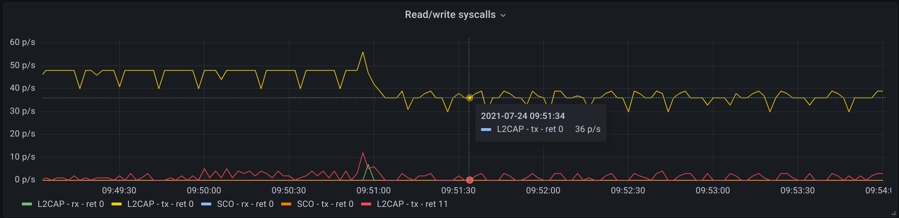
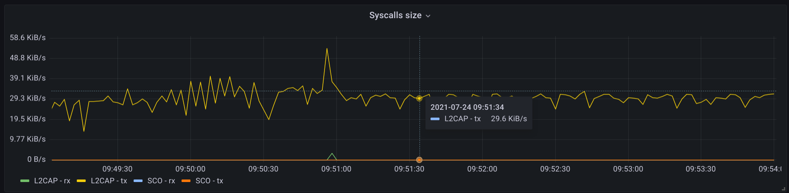
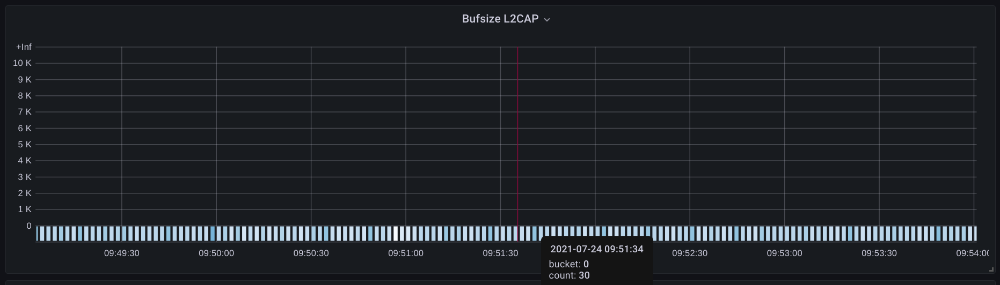
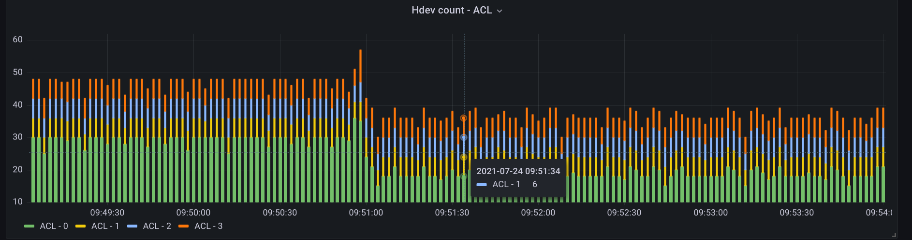
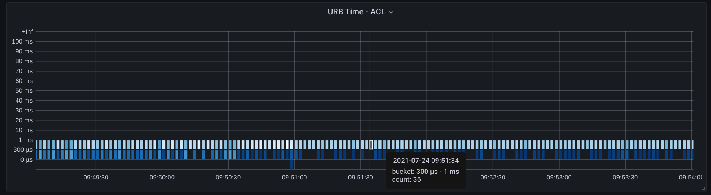
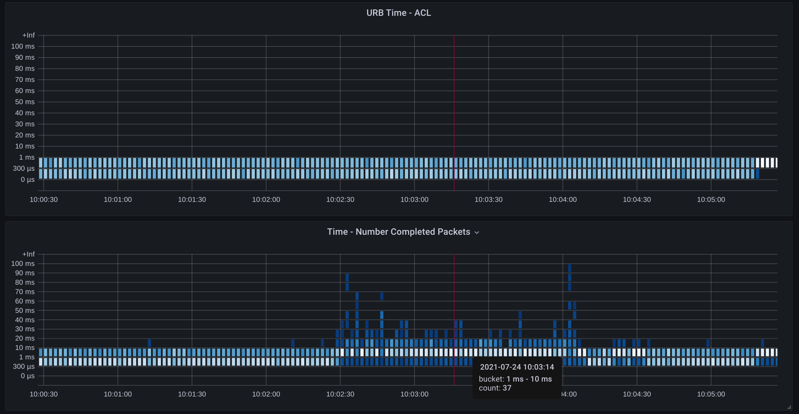

# bluetooth_exporter

Uses [ebpf_exporter](https://github.com/cloudflare/ebpf_exporter) to export prometheus metrics about bluetooth data in the linux and it brings a grafana and prometheus on docker-compose for easy visualization of this data.

## Running

```shell
# Requires ebpf_exporter to be installed in the host
go get -u -v github.com/cloudflare/ebpf_exporter/
sudo ebpf_exporter --config.file=config.yaml
# In another terminal session to start prometheus and grafana
docker-compose -f docker/docker-compose.yaml up
# Visit http://localhost:3000 with user admin and password foobar and check the panel
```

## Bluetooth on kernel
The responsibility of the kernel is to be the bridge between user space and the bluetooth controller. The user space interface is a socket.

``` c
// Always the same domain is used. AF_BLUETOOTH and PF_BLUETOOTH are equivalent
int fd = socket(PF_BLUETOOTH, SOCK_SEQPACKET, BTPROTO_L2CAP);
int fd = socket(PF_BLUETOOTH, SOCK_SEQPACKET, BTPROTO_SCO);
int fd = socket(PF_BLUETOOTH, SOCK_RAW, BTPROTO_HCI);
```

The protocol passed as the third argument is different based on the use cases of the user.
`BTPROTO_L2CAP` on top of `ACL` is used for high-quality audio, `BTPROTO_SCO` 
for bi-directional and simultaneous voice and (poorer) audio,
and `BTPROTO_HCI` to talk directly to the controller.

Based on the type of protocol, the kernel uses different files to handle incoming/outgoing data from user space.
It register socket types and the callbacks defined on [struct proto_ops](https://github.com/torvalds/linux/search?q=path%3Anet%2Fbluetooth+proto_ops) are invoked whenever user space wants to connect, bind or write/read data.

## Life of a bluetooth packet inside the kernel
To understand some of these metrics, let's trace the life of a bluetooth L2CAP audio packet.

1. user space writes binary data that should be delivered as L2CAP protocol to the connected device.
``` c
struct buffer *buf = alloc_data();
write(fd, buf->data, buf->size);
```

2. Inside `bluetooth` module, the callback declared in the `sendmsg` field of `struct proto_ops` is called. In this specific case, the function is `l2cap_sock_sendmsg`, which receives a `struct msghdr` containing data from user space.

3. The `struct msghdr` is converted into a `struct sk_buff` that's now used across this layer.

4. After that, it adds this `sk_buff` into a linked list `data_q` inside `l2cap_chan`.
This list is initialized in the socket creation.
After that, a `struct work_struct` is enqueued in a `workqueue` associated with the controller.

5. Later, in a worker thread, the function `hci_tx_work` is invoked and tries to dequeue all the `sk_buffs` from all the sockets. This `skb_buff` from the list is eventually dequeued and sent to the `btusb` lower layer.

6. The `btusb` module receives the `sk_buff` and converts it to a [USB Request Block (urb)](https://www.kernel.org/doc/html/latest/driver-api/usb/URB.html) setting all its configuration and callbacks. `usb_submit_urb` is then called to allow the lower layer to perform the communication.

7. The `xhci_hcd` module interfaces with USB devices and it's responsible to send the `struct urb` the endpoint address registered by the controller.

8. The controller receives this and sends this data to the device.
The code is closed source and generally, vendors export only the blobs inside the [linux-firmware](https://git.kernel.org/pub/scm/linux/kernel/git/firmware/linux-firmware.git) project.

9. After the packet is transmitted, the controller sends back an event packet to update the availability signalling that this slot can now be used by a new packet.

The first layer lives in the `bluetooth` module. Then it goes to modules `btusb` and finally to `xhci_hcd`.
Receiving a packet from the controller goes the reverse direction from `xhci_hcd`, `btusb` and `bluetooth` until the data is handled by the socket reading it.

## Metrics
This project attaches some kprobes and kretprobes events inside the kernel to export prometheus data of some relevant bluetooth state.

### Number of blutetooth read/write on the socket
Number of times that a `read` and `write` are called on all the bluetooth sockets.
Additionally, the return of the syscall is registered and it's possible to map errors in [errono-base.h file](https://github.com/torvalds/linux/blob/v5.13/tools/include/uapi/asm-generic/errno-base.h)

Notice how the number of packets decrease and are more unstable when the audio codec is changed from aac to sbc.



### Total size of bluetooth read/write on the socket
Same as metric above, but shows the length of the read/writes

The size of the packet is the same even when changing codecs.


### Write allocations from socket
When a new `sk_buff` is being allocated, there is a verification that checks if the field `sk_wmem_alloc` on the `struct sock` is bigger than `sk_sndbuff`. If it's bigger, then it has two options:
When the socket is set as non-blocking, a `EAGAIN` (-11) error is returned.
When a socket is blocking, then the call is in a loop until `sk_wmem_alloc` is smaller.
This verification is done in the function [sock_alloc_send_pskb](https://github.com/torvalds/linux/blob/v5.13/net/core/sock.c#L2334)

The default value of `sk_sndbuff` (taken from `/proc/sys/net/core/wmem_default`) is pretty high.
So, pipewire and pulseaudio set a much [lower value](https://github.com/pulseaudio/pulseaudio/blob/bea3fa7d21fdf7d90b73270e836bfffb41cc6fdc/src/modules/bluetooth/module-bluez5-device.c#L547) to avoid out of sync errors.

This metric shows a heatmap showing the value of `sk_wmem_alloc` every time an L2CAP or SCO send syscall is called.



### Size of acl_cnt, le_cnt and sco_cnt in hci_dev
Every `struct hci_dev` associated with a controller has the fields `acl_cnt`, `sco_cnt` and `le_cnt`.
When a `acl` or `le` packet is sent to `btusb`, `acl_cnt` or `le_cnt` is decremented.
After the packet is acknowledged, the controller sends an event packet of type `HCI_EV_NUM_COMP_PKTS` (0x13) with the processed packets. This value is then incremented to these fields.

The controller sends an event package of type `HCI_EV_NUM_COMP_PKTS` with the number of completed packets.
When `acl_cnt`, `le_cnt` or `sco_cnt` reach 0, then no packets are dequeued from the queue and consequently not sent to `btusb`. This is used to not overflood the controller with packets it can't handle.



### ACL/SCO URB time
Tracks the time of how long the `urb` took to be completed after it's submitted.
The delta is taken from the time of when the `sk_buff` is sent to `btusb` layer until the callback configured on `usb_complete_t` field of the `urb` is invoked.



### ACL Number of completed packets
Shows the delta when the packet hits the `btusb` layer until the controller sends back the event packet `HCI_EV_NUM_COMP_PKTS`.

When taking the headset to the kitchen for around 1 minute and a half, the time the controller acknowledges a packet is higher, but the time to send the `urb` to the controller remains the same.


**Notice**: There is an issue that happened a few times that this event packet is not sent on my controller (AX200).
This means the `BPF_QUEUE` is outdated and presents a wrong value.

## Development
The eBPF programs are c files living in `src`.
There are python scripts inside `python` that prints the eBPF data structures for a quicker development cycle.

`ebpf_exporter` expects that all metrics to be in a single YAML file. The script`aggregate.py` merges the individual metrics configuration from `exporter` with the eBPF programs from `src`

## Disclaimer
All of the tests were done on a single controller and a couple of devices.
Open an issue if you think any of these eBPF programs or metrics could be misleading in another devices or kernel versions.
